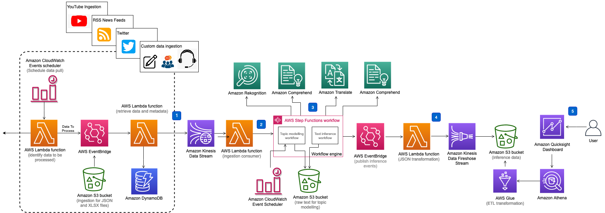
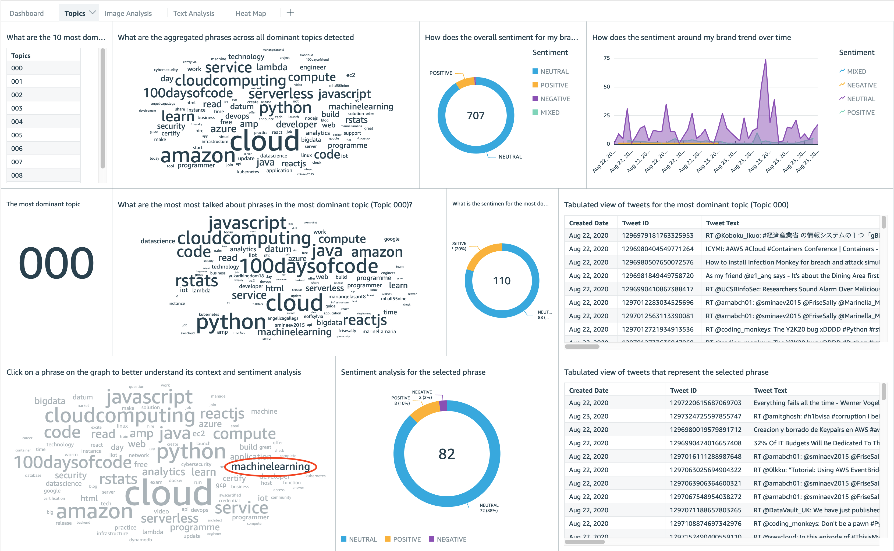

## Discovering Hot Topics using Machine Learning

The Discovering Hot Topics Using Machine Learning solution helps you identify the most dominant topics associated with your products, policies, events, and brands. Implementing this solution helps you react quickly to new growth opportunities, address negative brand associations, and deliver higher levels of customer satisfaction.

The solution automates digital asset (text and image) ingestion from twitter, RSS news feeds, and YouTube comments to provide near-real-time inferences using machine learning algorithms through Amazon Comprehend, Amazon Translate, and Amazon Rekognition to perform topic modeling, sentiment analysis, entity and key phrase detection, and detect any unsafe images. The solution then visualizes these large-scale customer analyses using an Amazon QuickSight dashboard. This guide provides step-by-step instructions for deploying this solution including a pre-built dashboard that provides you with the context and insights necessary to identify trends that help or harm your brand.

The solution performs the following key features:

-   **Performs topic modeling to detect dominant topics**: identifies the terms that collectively form a topic from within customer feedback
-   **Identifies the sentiment of what customers are saying**: uses contextual semantic search to understand the nature of online discussions
-   **Determines if images associated with your brand contain unsafe content**: detects unsafe and negative imagery in content
-   **Helps customers identify insights in near real-time**: you can use a visualization dashboard to better understand context, threats, and opportunities almost instantly

This solution deploys an AWS CloudFormation template that supports Twitter, RSS feeds, and YouTube comments as data source options for ingestion, but the solution can be customized to aggregate other social media platforms and internal enterprise systems.

For a detailed solution deployment guide, refer to [Discovering Hot Topics using Machine Learning](https://aws.amazon.com/solutions/implementations/discovering-hot-topics-using-machine-learning)

## On this Page

-   [Architecture Overview](#architecture-overview)
-   [Deployment](#deployment)
-   [Source Code](#source-code)
-   [Creating a custom build](#creating-a-custom-build)

## Architecture Overview

Deploying this solution with the default parameters builds the following environment in the AWS Cloud. The overall architecture of the solution has the following key components. Note that the below diagram represents Twitter and news feeds as ingestion sources - there are plans to add other social media platforms in future releases.

<p align="center">
  
  <br/>
</p>

The architecture of the solution includes the following key components and workflows:

1. Ingestion – Twitter, RSS feeds, and YouTube comments ingestion and management using Lambda functions, Amazon DynamoDB, and Amazon CloudWatch Event Scheduler. For detailed reference architecture diagrams for Twitter, YouTube comment, and RSS news feed ingestion, refer to the [implementation guide](https://docs.aws.amazon.com/solutions/latest/discovering-hot-topics-using-machine-learning/overview.html).

2. Data Stream — The data is buffered through Amazon Kinesis Data Streams to provide resiliency and throttle incoming requests. The Data Streams have a configured DLQ to catch any errors in processing feeds.

3. Workflow – Consumer (Lambda function) of the Data Streams initiates a Step Functions workflow that orchestrates Amazon Machine Learning capabilities including: Amazon Translate, Amazon Comprehend, and Amazon Rekognition.

4. Integration – The inference data integrates with the storage components through an event-driven architecture using Amazon EventBridge. EventBridge allows further customization to add additional targets by configuring rules.

5. Storage and Visualization – A combination of Kinesis Data Firehose, Amazon S3 buckets, AWS Glue tables, Amazon Athena, and Amazon QuickSight.

<p align="center">
  
  <br/>
</p>

After you deploy the solution, use the included Amazon QuickSight dashboard to visualize the solution's machine learning inferences. The image above is an example visualization dashboard featuring a dominant topic list, donut charts, weekly and monthly trend graphs, a word cloud, a tweet table, and a heat map.

# AWS CDK Constructs

[AWS CDK Solutions Constructs](https://aws.amazon.com/solutions/constructs/) make it easier to consistently create well-architected applications. All AWS Solutions Constructs are reviewed by AWS and use best practices established by the AWS Well-Architected Framework. This solution uses the following AWS CDK Constructs:

-   aws-events-rule-lambda
-   aws-kinesisfirehose-s3
-   aws-kinesisstreams-lambda
-   aws-lambda-dynamodb
-   aws-lambda-s3
-   aws-lambda-step-function
-   aws-sqs-lambda

## Deployment

The solution is deployed using a CloudFormation template with a lambda backed custom resource that builds the Amazon QuickSight Analaysis and Dashboards. For details on deploying the solution please see the details on the solution home page: [Discovering Hot Topics Using Machine Learning](https://aws.amazon.com/solutions/implementations/discovering-hot-topics-using-machine-learning/)

## Source Code

### Project directory structure

```
├── deployment                          [folder containing build scripts]
│   ├── cdk-solution-helper             [A helper function to help deploy lambda function code through S3 buckets]
│   ├── build-s3-dist.sh                [Build script to build the solution]
└── source                              [source code containing CDK App and lambda functions]
    ├── bin                             [entrypoint of the CDK application]
    ├── lambda                          [folder containing source code the lambda functions]
    │   ├── capture_news_feed           [lambda function to ingest news feeds]
    │   ├── create-partition            [lambda function to create glue partitions]
    │   ├── firehose_topic_proxy        [lambda function to write topic analysis output to Amazon Kinesis Firehose]
    │   ├── firehose-text-proxy         [lambda function to write text analysis output to Amazon Kinesis Firehose]
    │   ├── ingestion-consumer          [lambda function that consumes messages from Amazon Kinesis Data Stream]
    │   ├── ingestion-producer          [lambda function that makes Twitter API call and pushes data to Amazon Kinesis Data Stream]
    │   ├── ingestion-youtube           [lambda function that ingests comments from YouTube videos and pushes data to Amazon Kinesis Data Stream]
    │   ├── integration                 [lambda function that publishes inference outputs to Amazon Events Bridge]
    │   ├── layers                      [lambda layer function library for Node and Python layers]
    │   │   ├── aws-nodesdk-custom-config
    │   │   ├── python_lambda_layer
    │   ├── quicksight-custom-resources [lambda function to create Amazon QuickSight resources, example: data source, data sets, analysis and dashboards]
    │   ├── solution_helper             [lambda function that allows capturing metrics for this solution]
    │   ├── storage-firehose-processor  [lambda function that writes data to S3 buckets to build a relational model]
    │   ├── wf-analyze-text             [lambda function to detect sentiments, key phrases and entities using Amazon Comprehend]
    │   ├── wf-check-topic-model        [lambda function to check status of topic modeling jobs on Amazon Comprehend]
    │   ├── wf-detect-language          [lambda function to detect language of ingested text content using Amazon Comprehend]
    │   ├── wf-detect-moderation-labels [lambda function to detect content moderation using Amazon Rekognition]
    │   ├── wf-extract-text-in-image    [lambda function to extract text content from images using Amazon Rekognition]
    │   ├── wf-publish-text-inference   [lambda function to publish Amazon Comprehend inferences]
    │   ├── wf-submit-topic-model       [lambda function to submit topic modeling job]
    │   ├── wf-translate-text           [lambda function to translate non-english text using Amazon Translate]
    │   └── wf_publish_topic_model      [lambda function to publish topic modeling inferences from Amazon Comprehend]
    ├── lib
    │   ├── aspects                     [CDK Aspects definitions to inject attributes during the prepare phase]
    │   ├── awsnodejs-lambda-layer      [Lambda layer construct for lambda functions that run on Nodejs runtime]
    │   ├── ingestion                   [CDK constructs for data ingestion]
    │   ├── integration                 [CDK constructs for Amazon Events Bridge]
    │   ├── quicksight-custom-resources [CDK construct that invokes custom resources to create Amazon QuickSight resources]
    │   ├── storage                     [CDK constructs that define storage of the inference events]
    │   ├── text-analysis-workflow      [CDK constructs for text analysis of ingested data]
    │   ├── topic-analysis-workflow     [CDK constructs for topic visualization of ingested data]
    │   └── visualization               [CDK constructs to build a relational database model for visualization]
```

## Creating a custom build

The solution can be deployed through the CloudFormation template available on the solution home page: [Discovering Hot Topics Using Machine Learning](https://aws.amazon.com/solutions/implementations/discovering-hot-topics-using-machine-learning/). To make changes to the solution, using the below steps download or clone this repo, update the source code and then run the deployment/build-s3-dist.sh script to deploy the updated Lambda code to an Amazon S3 bucket in your account.

### 1. Clone the repository

Clone this git repository

`git clone https://github.com/awslabs/<repository_name>`

### 2. Build the solution for deployment

-   To run the unit tests

```
cd <rootDir>/source
chmod +x ./run-all-tests.sh
./run-all-tests.sh
```

-   Configure the bucket name of your target Amazon S3 distribution bucket

```
export DIST_OUTPUT_BUCKET=my-bucket-name
export VERSION=my-version
```

-   Now build the distributable:

```
cd <rootDir>/deployment
chmod +x ./build-s3-dist.sh
./build-s3-dist.sh $DIST_OUTPUT_BUCKET $SOLUTION_NAME $VERSION $CF_TEMPLATE_BUCKET_NAME QS_TEMPLATE_ACCOUNT

```

-   Parameter details

```
$DIST_OUTPUT_BUCKET - This is the global name of the distribution. For the bucket name, the AWS Region is added to the global name (example: 'my-bucket-name-us-east-1') to create a regional bucket. The lambda artifact should be uploaded to the regional buckets for the CloudFormation template to pick it up for deployment.
$SOLUTION_NAME - The name of This solution (example: discovering-hot-topics-using-machine-learning)
$VERSION - The version number of the change
$CF_TEMPLATE_BUCKET_NAME - The name of the S3 bucket where the CloudFormation templates should be uploaded
$QS_TEMPLATE_ACCOUNT - The account from which the Amazon QuickSight templates should be sourced for Amazon QuickSight Analysis and Dashboard creation
```

-   When creating and using buckets it is recommeded to:

    -   Use randomized names or uuid as part of your bucket naming strategy.
    -   Ensure buckets are not public.
    -   Verify bucket ownership prior to uploading templates or code artifacts.

-   Deploy the distributable to an Amazon S3 bucket in your account. _Note:_ you must have the AWS Command Line Interface installed.

```
aws s3 cp ./global-s3-assets/ s3://my-bucket-name-<aws_region>/discovering-hot-topics-using-machine-learning/<my-version>/ --recursive --acl bucket-owner-full-control --profile aws-cred-profile-name
aws s3 cp ./regional-s3-assets/ s3://my-bucket-name-<aws_region>/discovering-hot-topics-using-machine-learning/<my-version>/ --recursive --acl bucket-owner-full-control --profile aws-cred-profile-name
```

## Collection of operational metrics

This solution collects anonymous operational metrics to help AWS improve the quality and features of the solution. For more information, including how to disable this capability, please see the [implementation guide](https://docs.aws.amazon.com/solutions/latest/discovering-hot-topics-using-machine-learning/operational-metrics.html).

---

Copyright 2020-2021 Amazon.com, Inc. or its affiliates. All Rights Reserved.

Licensed under the Apache License, Version 2.0 (the "License");
you may not use this file except in compliance with the License.
You may obtain a copy of the License at

    http://www.apache.org/licenses/LICENSE-2.0

Unless required by applicable law or agreed to in writing, software
distributed under the License is distributed on an "AS IS" BASIS,
WITHOUT WARRANTIES OR CONDITIONS OF ANY KIND, either express or implied.
See the License for the specific language governing permissions and
limitations under the License.
