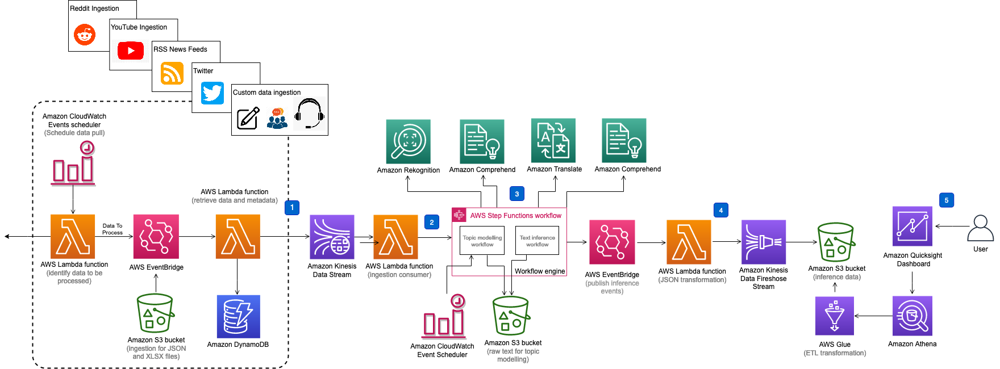

## Discovering Hot Topics using Machine Learning

With so much customer sentiment available for analysis today, understanding the contextualization of the most relevant topics can be difficult at scale. Separating the signal from the noise requires analysis that goes beyond basic aggregation of sentiment analysis. Diving deeper and truly understanding the conversation at scale can help organizations to succeed in the market, identify new opportunities and react quickly.

The Discovering Hot Topics Using Machine Learning solution addresses the problem of organizing large-scale customer feedback analytics by automating ingesting digital assets and performing near real-time analysis using machine learning algorithms. Organizations can gain insight about new product launches, service announcements, public relations, crisis management, and changes to company policies that impact their customers.

This solution ingests text and images from online discourse and performs topic and sentiment analyses, and detect unsafe content in images. The default input data source for the solution is Twitter, but it can be extended to ingest other social media platforms in addition to any stream from an enterprise’s internal systems. The output of this inference is organized and visualized in a dashboard for users to consult and analyze. 

For an overview and solution deployment guide, please visit [Discovering Hot Topics using Machine Learning](https://aws.amazon.com/solutions/implementations/discovering-hot-topics-using-machine-learning)

## Architecture Diagram

Deploying this solution with the default parameters builds the following environment in the AWS Cloud. The overall architecture of the solution has the following key components. Note that the below diagram represents Twitter as the ingestion feed - there are plans to add other social media platforms in future releases.
<p align="center">
  
  <br/>
</p>

* Ingestion – Social media feed ingestion using a combination of Lambda functions, Kinesis Data Stream and DynamoDB to manage state
* Workflow – An AWS Step Function based workflow to orchestrate various services
* Inference – AWS Cloud’s machine learning capabilities through Amazon Translate, Amazon Comprehend, and Amazon Rekognition
* Application Integration – Event based architecture approach through the use of AWS Events Bridge
* Storage and Visualization – A combination of Kinesis Data Firehose, S3 Buckets, Glue, Athena and QuickSight

Once the solution is deployed, use QuickSight to create a dashboard like the one below.

<p align="center">
  
  <br/>
</p>

This is an example Amazon QuickSight dashboard built by the solution. The first row of visuals in the dashboard shows the aggregation of all the dominant topics detected, and the second row drills down to the most dominant topic '000'. The bottom left corner of the image demonstrates that selecting a specific phrase (in this example, machine learning) in the word cloud filters the data for the related donut chart and table.

## 1. Build the solution

Clone this git repository

`git clone https://github.com/awslabs/<repository_name>`

## 2. Build the solution for deployment

* To run the unit tests
```
cd <rootDir>/source
chmod +x ./run-all-tests.sh
./run-all-tests.sh
```

* Configure the bucket name of your target Amazon S3 distribution bucket
```
export DIST_OUTPUT_BUCKET=my-bucket-name # bucket where customized code will reside
export VERSION=my-version # version number for the customized code
```
_Note:_ You would have to create an S3 bucket with the prefix 'my-bucket-name-<aws_region>'; aws_region is where you are testing the customized solution. Also, the assets in bucket should be publicly accessible.

* Now build the distributable:
```
cd <rootDir>/deployment
chmod +x ./build-s3-dist.sh
./build-s3-dist.sh $DIST_OUTPUT_BUCKET $SOLUTION_NAME $$VERSION
```

* Deploy the distributable to an Amazon S3 bucket in your account. _Note:_ you must have the AWS Command Line Interface installed.
```
aws s3 cp ./global-s3-assets/ s3://my-bucket-name-<aws_region>/discovering-hot-topics-using-machine-learning/<my-version>/ --recursive --acl bucket-owner-full-control --profile aws-cred-profile-name
aws s3 cp ./regional-s3-assets/ s3://my-bucket-name-<aws_region>/discovering-hot-topics-using-machine-learning/<my-version>/ --recursive --acl bucket-owner-full-control --profile aws-cred-profile-name
```

## Project directory structure
```
├── deployment                          [folder containing build scripts]
│   ├── cdk-solution-helper             [A helper function to help deploy lambda function code through S3 buckets]
└── source                              [source code containing CDK App and lambda functions]
    ├── bin                             [entrypoint of the CDK application]
    ├── lambda                          [folder containing source code the lambda functions]
    │   ├── firehose-text-proxy         [lambda function to write text analysis output to Amazon Kinesis Firehose]
    │   ├── firehose_topic_proxy        [lambda function to write topic analysis output to Amazon Kinesis Firehose]
    │   ├── ingestion-consumer          [lambda function that consumes messages from Amazon Kinesis Data Stream]
    │   ├── ingestion-producer          [lambda function that makes Twitter API call and pushes data to Amazon Kinesis Data Stream]
    │   ├── integration                 [lambda function that publishes inference outputs to Amazon Events Bridge]
    │   ├── storage-firehose-processor  [lambda function that writes data to S3 buckets to build a relational model]
    │   ├── wf-analyze-text             [lambda function to detect sentiments, key phrases and entities using Amazon Comprehend]
    │   ├── wf-check-topic-model        [lambda function to check status of topic modeling jobs on Amazon Comprehend]
    │   ├── wf-detect-moderation-labels [lambda function to detect content moderation using Amazon Rekognition]
    │   ├── wf-extract-text-in-image    [lambda function to extract text content from images using Amazon Rekognition]
    │   ├── wf-publish-text-inference   [lambda function to publish Amazon Comprehend inferences]
    │   ├── wf-submit-topic-model       [lambda function to submit topic modeling job]
    │   ├── wf-translate-text           [lambda function to translate non-english text using Amazon Translate]
    │   └── wf_publish_topic_model      [lambda function to publish topic modeling inferences from Amazon Comprehend]
    ├── lib
    │   ├── ingestion                   [CDK constructs for data ingestion]
    │   ├── integration                 [CDK constructs for Amazon Events Bridge]
    │   ├── storage                     [CDK constructs that define storage of the inference events]
    │   ├── text-analysis-workflow      [CDK constructs for text analysis of ingested data]
    │   ├── topic-analysis-workflow     [CDK constructs for topic visualization of ingested data]
    │   └── visualization               [CDK constructs to build a relational database model for visualization]
```

***

Copyright 2020 Amazon.com, Inc. or its affiliates. All Rights Reserved.

Licensed under the Apache License, Version 2.0 (the "License");
you may not use this file except in compliance with the License.
You may obtain a copy of the License at

    http://www.apache.org/licenses/LICENSE-2.0

Unless required by applicable law or agreed to in writing, software
distributed under the License is distributed on an "AS IS" BASIS,
WITHOUT WARRANTIES OR CONDITIONS OF ANY KIND, either express or implied.
See the License for the specific language governing permissions and
limitations under the License.
